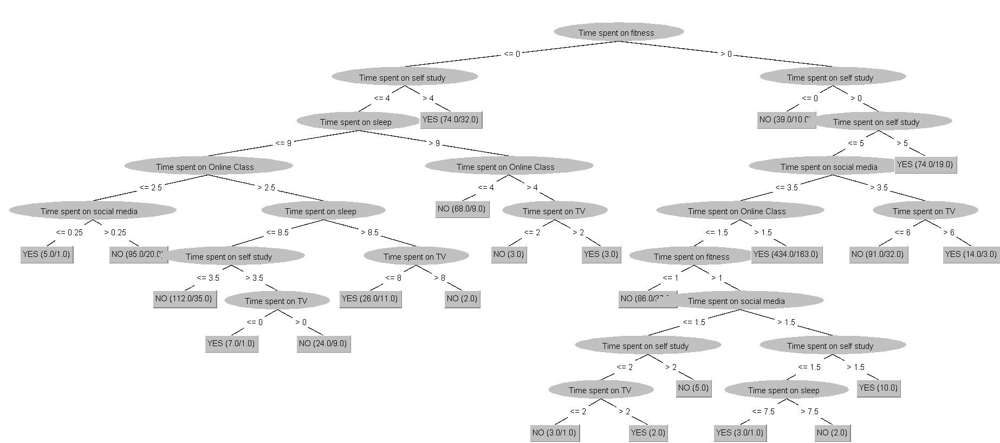
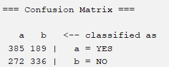

# 📊 COVID-19 Student Time Analysis (Data Mining)

## 📌 Overview
This project analyzes how students managed their time during the COVID-19 pandemic using data mining techniques.

The study uses a real-world dataset to identify behavioral patterns and predict whether students utilized their time effectively.

---

## 🎯 Objective
- Analyze student daily activities during lockdown  
- Identify key factors affecting time management  
- Apply data mining classification techniques  
- Compare performance of different algorithms  

---

## 📂 Dataset
- Source: Kaggle (COVID-19 Student Survey Dataset)  
- Records: 1,182 students  

### Features:
- Online Class Time  
- Self-Study Time  
- Fitness Time  
- Sleep Time  
- Social Media Usage  
- TV Time  

### Target:
- Time Utilized (YES / NO)

---

## 🧠 Techniques Used
- J48 Decision Tree  
- Naïve Bayes Classifier  

Evaluation Method:
- 10-fold Cross-Validation  

---

## 📊 Results

### Decision Tree (J48)

### J48 Confusion Matrix

### Naïve Bayes Confusion Matrix

### Accuracy Results

---

## 📊 Results Visualization
The project includes visual outputs generated using WEKA, such as:

- Decision Tree model (J48)  
- Confusion Matrices for both classifiers  
- Accuracy and evaluation metrics  

These results help in understanding model performance and behavior patterns.

---

## 🔍 Key Insights
- Self-study time is the most important factor  
- Fitness and sleep contribute to better time management  
- High social media usage negatively impacts productivity  
- Balanced lifestyle leads to better outcomes  

---

## 📂 Dataset Format
The dataset is provided in ARFF format, which is compatible with the WEKA data mining tool.

It contains numerical attributes representing daily student activities and a target class indicating whether time was utilized effectively (YES/NO).

---

## 📂 Project Structure
covid19-student-time-analysis/  
│  
├── dataset/  
├── results/  
├── report/  
└── README.md  

---

## 📌 Note
This is an academic project demonstrating data mining and data analysis techniques using WEKA.
